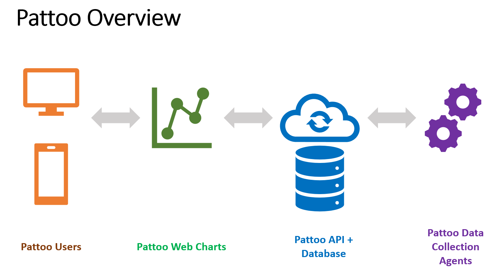

Introduction
============

`pattoo` stores timeseries data in a database and makes it available for users via a GraphQL API.

Data can be collected from a number of sources. The `pattoo-agents` repository provides a number standard data collection agents for:

- Linux
- SNMP
- Modbus TCP
- BACnet/IP
- OPC UA

`pattoo` was originally created to assist DevOps and building facilities
management teams to monitor the performance of servers, applications and
electro-mechanical systems. It is flexible enough to chart a wide variety of
data that changes over time by creating custom agents. [Documentation on how to do this can be found here.](https://pattoo-shared.readthedocs.io/en/latest/agents.html)

`pattoo` currently only runs on Linux systems.

Version
-------

`pattoo` is currently in alpha testing. Coders are welcome to add new features
and fix bugs. Each `pattoo` GitHub repository has its own issues section for
reporting bugs and making feature requests.

Demo Site
---------

The [Pattoo demo site](http://nylon.palisadoes.org/pattoo/web/) runs the
current stable version of code.

Getting Started
===============

Here's what you need to know about `pattoo`.

There are four primary components to `pattoo`. These are:

- **pattoo**: The central API and database system that receives data from `pattoo-agents` and
makes it available over the network via a web API.
- **pattoo-agents**: Data collection agents that report data to the `pattoo`
server.
- **pattoo-web**: A web UI that allows you to view the data stored on the
`pattoo` server.
- **pattoo-shared**: A shared set of software libraries used by all `pattoo`
applications.

Let's discuss how to install each of them.

Component Installation
======================

Each component has detailed documentation which is listed below. The
recommended order of installation is:

1. **pattoo**
1. **pattoo-agents**
1. **pattoo-web**

The next section has links to sites that explain the installation of each.

The `pattoo-shared` component is automatically installed whenever any of the
other three are installed.

Documentation
=============

There are a number of sets of documents that cover the `pattoo`
portfolio.

Pattoo
------

The data collection server that acts as the central repository of data
provided by the `pattoo` agents.

- [View **Pattoo Server Documentation**](https://pattoo.readthedocs.io/)
- [Download **ZIP File**](https://github.com/PalisadoesFoundation/pattoo/zipball/master)
- [Download **TAR Ball**](https://github.com/PalisadoesFoundation/pattoo/tarball/master)
- [View On **GitHub**](https://github.com/PalisadoesFoundation/pattoo)

Pattoo-Agents
-------------

`pattoo` agents collect data from a variety of sources and send them to
the central `pattoo` server over HTTP. We provide a few standard agents,
but you can create your own. (See Pattoo-Shared for details)

- [View **Pattoo Agents Documentation**](https://pattoo-agents.readthedocs.io/)
- [Download **ZIP File**](https://github.com/PalisadoesFoundation/pattoo-agents/zipball/master)
- [Download **TAR Ball**](https://github.com/PalisadoesFoundation/pattoo-agents/tarball/master)
- [View On **GitHub**](https://github.com/PalisadoesFoundation/pattoo-agents)

Pattoo-Web
----------

The web user interface to use to get access to the `pattoo` data.

- [View **Pattoo Web Documentation**](https://pattoo-web.readthedocs.io/)
- [Download **ZIP File**](https://github.com/PalisadoesFoundation/pattoo-web/zipball/master)
- [Download **TAR Ball**](https://github.com/PalisadoesFoundation/pattoo-web/tarball/master)
- [View On **GitHub**](https://github.com/PalisadoesFoundation/pattoo-web)

Pattoo-Shared
-------------

All other `pattoo` components use this shared python library. This must be
pre-installed using `pip3` for them to work. Fortunately the each component's
installation scripts automatically does this for you.

You can use the `pattoo-shared` documentation to learn the basics of
creating your own custom `pattoo-agents` to feed data to the `pattoo`
server

- [View **Pattoo Shared Documentation**](https://pattoo-shared.readthedocs.io/)
- [Download **ZIP File**](https://github.com/PalisadoesFoundation/pattoo-shared/zipball/master)
- [Download **TAR Ball**](https://github.com/PalisadoesFoundation/pattoo-shared/tarball/master)
- [View On **GitHub**](https://github.com/PalisadoesFoundation/pattoo-shared)

About The Palisadoes Foundation
===============================

`pattoo` is based on the original `infoset` code created by the
[Palisadoes Foundation](http://www.palisadoes.org) as part of its annual
Calico Challenge program. Calico provides paid summer internships for
Jamaican university students to work on selected open source projects.
They are mentored by software professionals and receive stipends based
on the completion of predefined milestones. Calico was started in 2015.
